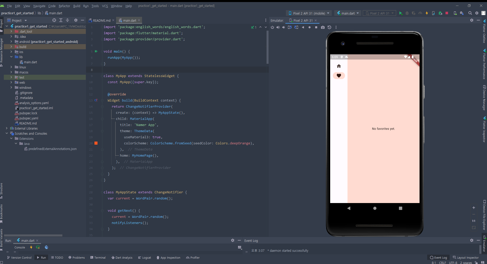
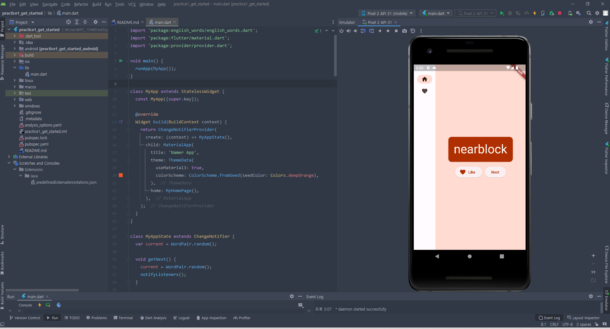
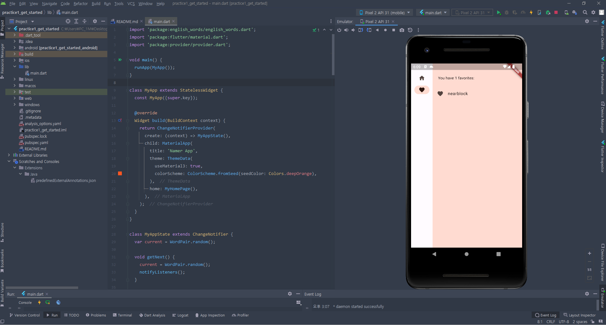

# get_started

A new Flutter project.

## Getting Started

This project is a starting point for a Flutter application.

랜덤 단어 / Next 버튼 / 좋아요 / 좋아요 목록

   

## Req-1 : Futter 의 Hot Reloaded 기술이란 무엇인가?

#

앱이 실행 중인 상태에서 코드를 수정하면서 그 결과를 바로 볼 수 있게 해준다.

이로인해 개발자의 편리성, 특히 UI수정 과정에서 더 빠른 개발을 가능하게 만든다.

   

#

## Req-2 : Flutter는 기본적으로 Debug 모드로 실행된다. Debug 모드는 Debugging 정보를 포함해 매우 느리게 앱이 실행된다. 공식문서를 참고해 개발 완료 후 이를 해결하기 위해 어떻게 처리를 해주어야 하는지 간략히 요약하시오.

#

개발 완료 후 릴리즈 모드로 앱을 빌드하면 된다.

릴리즈 모드에서는 디버깅 정보가 제거되여 앱의 성능이 향상된다.

   

#

## Req-3 : Flutter에서 외부 패키지는 어떤 방식으로 사용하는지 간략히 정리해 보자.

#

1. 프로젝트의 'pubspec.yaml' 파일에 패키지와 버전을 지정
2. 'flutter pub get' 로 패키지를 가져온다
3. import문 작성후 사용한다

   

#

## Req-4 : Write your first app 파트를 끝까지 구현해 보고 동작시킨 후 스크린샷을 포함 진행과정중 느낀점을 정리해보자

#

Hot Reload 기능으로 인해 즉시 결과를 볼수 있어서 편하다.

특히 안드로이드와 ios를 같이 개발하는거에 큰 이점이 있다고 생각한다.

대중성이 조금 떨어지는 Dart 언어라는 점이 단점인것 같다.